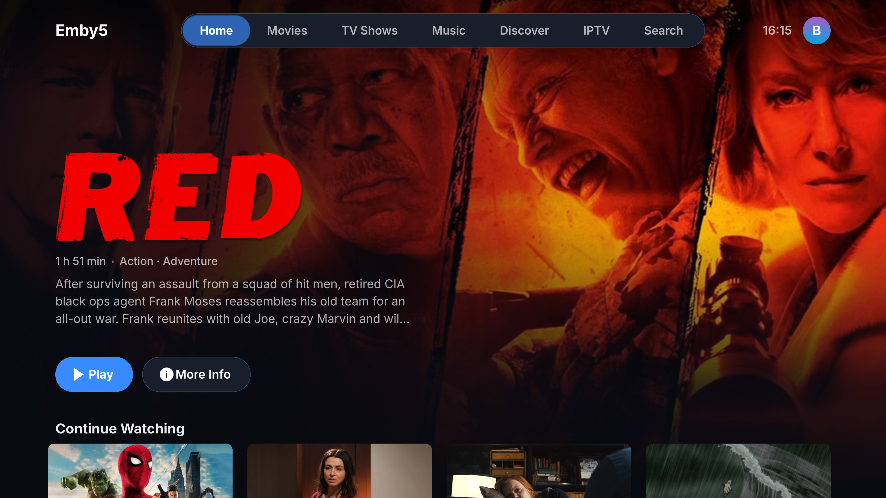

# Emby5 for PS5

**A native Emby media client for homebrew-enabled PlayStation 5 consoles.**

**Emby Libraries · Native PS5 Playback · IPTV · 31 Visual Themes**

Emby5 is an unofficial native Emby client for homebrew-capable PlayStation 5 consoles, derived from [Jelly5 by 02dnot](https://github.com/02dnot/Jelly5).

Emby5 is an independent community project and is not affiliated with or endorsed by Emby LLC, Sony Interactive Entertainment, Jelly5, or their respective developers.

---

**Contents:** [Features](#features) · [HDMI Bitstream](#hdmi-audio-bitstream) · [Known Limitations](#known-limitations) · [Controls](#controls) · [Installation](#installation) · [Updating](#updating) · [Credits](#credits--acknowledgements) · [Licence](#licence) · [Disclaimer](#disclaimer-and-trademarks)

---

## Features

### Interface and Libraries

Emby5 provides a native, GPU-rendered interface designed for navigating your Emby libraries on a television.

**Interface and customization**
- Native GPU-rendered PS5 interface.
- **31 selectable visual themes**, including the original Glass design.
- Theme-specific colors, panel treatments, borders, shadows, highlights, and bevels.
- Theme selection available under **Settings → Theme**.

**Browsing and navigation**
- Home screen with featured content, Continue Watching, Next Up, and Recently Added.
- Recommendations and genre browsing.
- Movies, TV shows, seasons, and episodes.
- Music libraries, artists, albums, and playlists.
- Media detail pages with artwork and metadata.
- Upcoming episodes appear in TV Show season details.
- Global search across movies, TV shows, and configured Xtream IPTV channels.
- Library sorting, filtering, favourites, and watched/unwatched status.
- A–Z library navigation.
- Artwork and backdrop loading, including placeholder rendering.
- Local storage for saved accounts and application settings.

**Note:** Some artwork may be unavailable or fail to load for particular items or libraries, depending on the Emby server and image-handling behavior.

### Servers and Accounts

Connect to your Emby server and manage multiple accounts directly from the application.

- Emby server discovery on the local network.
- Manual server addresses.
- Username/password authentication.
- Multiple saved users and servers.
- Account and server switching.
- Local storage of authentication and account configuration.

Saved accounts and application settings are intended to survive normal application restarts and folder-based updates.

### Playback

Emby5 uses a native PS5 playback engine with hardware video decoding.

**Video and streaming**
- Hardware-accelerated H.264 and HEVC decoding, including supported 4K content.
- HEVC Main 10 support.
- HDR10 and HLG output for compatible media and displays.
- Direct Play, Direct Stream, and Emby server transcoding.
- PS5-specific Emby playback negotiation and device profile.
- Media-source/version selection when multiple versions are available.

**Playback controls**
- Audio-track and subtitle-track selection.
- Playback speed options: **0.75×, 1×, 1.25×, 1.5×, and 2×**.
- Audio delay adjustment.
- Night mode.
- Seeking and trickplay thumbnails where supported by the server.

**Playback information and continuity**
- Playback progress, resume, and watched-state reporting.
- Automatic reconnection attempts after some network or stream interruptions.
- Playback information accessible through **L3**, including available codec, delivery, and buffering details.

**Note:** Playback speeds and audio handling may be limited by the selected output mode. Automatic recovery is not guaranteed for every connection failure.

### Intros, Credits, and Episodes

Emby5 includes episode navigation and automatic playback features.

- Emby media-segment integration.
- Skip Intro and Skip Recap when suitable segments are provided by the server.
- Optional automatic intro skipping.
- Credits/outro handling and Watch Credits functionality.
- In-player season and episode browsing.
- Next-episode card and countdown.
- Automatic next-episode playback.
- Optional **Are You Still Watching?** confirmation for unattended episode autoplay.

#### Are You Still Watching?

Configure this feature under **Settings → Playback**.

| Setting | Behaviour |
| --- | --- |
| **Off** | Disabled by default |
| **After 3 episodes** | Requests confirmation after consecutive unattended autoplay |
| **After 2 hours** | Requests confirmation at the next qualifying episode transition |

When the confirmation appears, press a controller button to continue to the next episode.

Controller activity during playback resets the unattended streak.

**This feature applies only to TV episode autoplay.** It does not affect music, IPTV, or movies.

### Audio and Subtitles

**Audio support**
- Playback of supported AAC, AC-3, E-AC-3, DTS-family, TrueHD, FLAC, Opus, MP3, and other FFmpeg-compatible audio formats, subject to codec and output limitations.
- Decoded PCM audio output for compatible formats.
- Optional HDMI bitstream output for supported AC-3, E-AC-3, and DTS-core streams.
- Audio-track selection while playing video.

**Subtitle support**
- Embedded and external subtitle tracks.
- Compatible text and bitmap subtitle formats, including SRT, ASS/SSA, PGS, DVD, DVB, and WebVTT.
- Subtitle-track selection and subtitle disabling during playback.
- Subtitle search and download when supported by the connected Emby server.
- Six Emby subtitle playback modes:
  - Default
  - Smart
  - Always
  - Only Forced
  - Hearing Impaired (SDH)
  - None

**Subtitle customization limitation:** The source contains subtitle size, position, delay, background, and outline controls. However, the customization submenu has not been confirmed accessible in the released PS5 interface. These controls are therefore not advertised as available functionality.

**Language preferences:** Preferred audio-language and preferred subtitle-language settings were removed from Emby5 1.0.0 because their behaviour was unreliable.

### Music

Browse and play music from your Emby library.

- Artist, album, and playlist browsing.
- Music playback while navigating the application.
- Mini player and Now Playing screen.
- Playback queue navigation.
- Shuffle and repeat.
- Lyrics display when lyrics are available from Emby.

### Seerr (Optional)

Emby5 includes optional integration with supported Seerr servers for media discovery and requests.

**Connection and discovery**
- Seerr connection configuration and connection testing.
- Account-associated sessions.
- Seerr search and discovery integration.
- Trending, popular, and upcoming content discovery.

**Media requests**
- Movie requests.
- Television and season-based requests.
- Request-status viewing.
- Request withdrawal and additional-season requests where supported.
- Radarr/Sonarr configuration options, subject to server support and user permissions.
- Local storage of Seerr configuration.

**Note:** Available functions depend on the connected Seerr version, server configuration, and account permissions.

### IPTV — Xtream Codes

Emby5 1.0.0 includes native IPTV integration for Xtream Codes-compatible providers.

**IPTV features**
- Dedicated IPTV tab.
- Xtream Codes-compatible server configuration.
- Separate server URL, username, and password entry under **Settings → IPTV**.
- Live television channel browsing.
- Xtream TS/HLS stream playback through Emby5's existing player.
- Channel categories.
- Custom category creation, renaming, deletion, and reordering.
- Assigning and removing channels from custom categories.
- Channel ordering within custom categories.
- Channel-name search during category assignment.
- IPTV channel-name support in global search.
- Local storage of Xtream configuration and category assignments.

#### IPTV Controller Navigation

| Button | Action |
| --- | --- |
| **Up** | From the first channel, focus the category selector |
| **Left / Right** | Change the selected category |
| **X** | Cycle categories when the category selector is focused |
| **Down** | Return to the channel list |
| **X** | Start playback when a channel is selected |

#### Custom Category Management

Manage custom categories under **Settings → IPTV**.

| Button | Action |
| --- | --- |
| **Triangle** | Open channel-name search |
| **Square** | Clear the search |
| **X** | Assign or remove a channel from the selected category |

IPTV browsing, custom categories, and live playback have been tested on PS5. Compatibility with individual providers and streams may vary.

**Important:** Emby5 does not supply IPTV channels, subscriptions, or credentials. A legitimate IPTV provider account is required.

### Visual Themes

Customize the appearance of Emby5 through **Settings → Theme**.

Emby5 includes **31 selectable themes**:

- **Glass** — the original Emby5 appearance and default theme.
- **30 additional themes** inspired by [BlackBearReloaded's PS5 Homebrew UI](https://github.com/blackbearreloaded/ps5-homebrew-ui).

The themes feature different combinations of:

- Colors and panel treatments.
- Borders and outlines.
- Shadows and highlights.
- Bevels and other visual styling.

Design adaptations include styles inspired by Brutal, Clay, Gloss, Classic, Blueprint, Hazard, Pixel, Sketch, and others.

Theme selection is stored in local application settings.

**Note:** These themes are recreated using Emby5's native PS5 AGC renderer. They are not direct OpenGL ports, complete interface replacements, or exact reproductions of every original visual effect.

See [docs/THEME_PRESETS.md](docs/THEME_PRESETS.md) for additional information.

### PS5 Integration

- Native PS5 application title ID: `PPSA99515`.
- DualSense controller navigation.
- Adaptive-trigger seeking support.
- DualSense light-bar integration.
- HDMI Device Link / HDMI-CEC input handling where supported.
- Optional 120 Hz UI output on compatible displays and PS5 configurations.
- Folder-based homebrew installation and updating.
- Optional GitHub update checking for `bornaradusin/Emby5`.

**Note:** Hardware-dependent features may behave differently across PS5 firmware versions and homebrew environments.

---

## HDMI Audio Bitstream

Emby5 1.0.0 includes optional HDMI bitstream handling for compatible audio streams.

| Format | Description |
| --- | --- |
| **AC-3** | Dolby Digital |
| **E-AC-3** | Dolby Digital Plus |
| **DTS core** | DTS core audio |

When bitstream output is unavailable or unsupported, the player attempts to use decoded PCM audio instead.

- Night mode disables bitstream output.
- TrueHD Atmos and DTS:X bitstream passthrough are not supported.

**Compatibility:** HDMI bitstream support is implemented in source, but compatibility with individual receivers, televisions, and audio configurations requires hardware testing.

---

## Known Limitations

The following limitations relate to the PS5 platform, the homebrew environment, or Emby5's current implementation.

**Audio and video**
- HDMI bitstream output requires compatible equipment and source formats.
- TrueHD Atmos and DTS:X bitstream passthrough are not supported.
- Dolby Vision compatibility depends on the source profile and playback path. Native Dolby Vision output is not supported, and some files may require server transcoding.
- AV1 is not supported by the intended PS5 hardware-decoding path and may require server transcoding.
- Native stereoscopic 3D output is not supported. Side-by-side and top-and-bottom 3D content is rejected by the application.

**Application limitations**
- Emby5 cannot terminate itself. Use the PS button to close it.
- Subtitle timing customization code exists, but its menu accessibility has been implemented yet.
- Preferred audio-language and subtitle-language selectors are not included in 1.0.0.
- Some album artwork may fail to appear in the music album grid.

---

## Controls

Emby5 is designed for navigation using the DualSense controller.

| Button | Menus | Player |
| --- | --- | --- |
| **X** | Select | Play / pause / select |
| **Circle** | Back | Hide controls / leave player |
| **D-pad** | Navigate | Show controls; Left/Right seek |
| **L1 / R1** | Previous / next tab | Seek backward / forward |
| **L2 / R2** | Previous / next A–Z letter | Adaptive rewind / fast-forward |
| **Triangle** | Search | Episodes |
| **Square** | Sort and filter | Audio and subtitle selection |
| **Options** | Item options | Playback controls |
| **Touchpad** | Now Playing while music plays | Playback controls |
| **L3** | — | Playback information |

Some buttons have additional functions within the IPTV interface and its category-management screens.

---

## Installation

### Installing Emby5

1. Download `Emby5-<version>.zip` from [GitHub Releases](https://github.com/bornaradusin/Emby5/releases).
2. Extract the downloaded ZIP.
3. Upload the included `PPSA99515/` folder to `/data/homebrew/` on the PS5.
4. Verify that the installation contains:

   `/data/homebrew/PPSA99515/eboot.bin`

5. If required by your ShadowMountPlus setup, set the `PPSA99515/` directory and its contents recursively to permission **777**.
6. Allow ShadowMountPlus approximately **15 seconds** to discover the application. If it does not appear, redeploy ShadowMountPlus and allow it to scan `/data/homebrew/` again.

### File Transfer Recommendation

During development and testing, **PS5Upload caused problems with transferred application files and permissions**.

For manual transfers, [ps5-web-file-manager by owendswang](https://github.com/owendswang/ps5-web-file-manager) or another compatible file-management tool is recommended.

After transferring, confirm that the installed application files have the required **0777 permissions** for your homebrew environment.

---

## Updating

1. Close Emby5 completely before updating.
2. Upload the new files from `PPSA99515/` over the existing installation at:

   `/data/homebrew/PPSA99515/`

3. **Do not delete the existing application directory or persistent data unless specifically necessary.**

Account information, local settings, and Seerr configuration are stored separately from the installed application files and are intended to be retained across normal folder-based updates.

---

## Credits & Acknowledgements

Emby5 builds upon and draws inspiration from the work of developers throughout the PlayStation 5 homebrew and open-source communities.

Full credit for the original projects and components belongs to their respective developers and contributors.

### Jelly5 — Original Application Foundation

**[02dnot — Jelly5](https://github.com/02dnot/Jelly5)**

Emby5 is based on and derived from Jelly5.

Jelly5 provided the original PS5-native application foundation, including major portions of the UI, playback architecture, rendering, controller integration, media handling, and platform-specific functionality.

Emby5 adapts this foundation for Emby-specific authentication, API integration, user management, libraries, branding, and additional features.

### Nuvio PS5 — Application and Playback Foundations

**[Husam Osman / theghostonline — Nuvio PS5](https://github.com/theghostonline/Nuvio-PS5)**

Credit for upstream PlayStation 5 application and playback foundations.

### EVO Player PS5 — Native Media Engine

**[sainsaji — EVO Player PS5](https://github.com/sainsaji/EVO-PLAYER-PS5)**

Credit for native PS5 media playback, decoding, rendering, and media-engine foundations.

### ProsperoTV — IPTV Reference and Inspiration

**[BlackBearReloaded — ProsperoTV](https://github.com/blackbearreloaded/ProsperoTV)**

Creator of ProsperoTV, a native PlayStation 5 IPTV homebrew application.

ProsperoTV is acknowledged as a reference and inspiration for IPTV development in Emby5.

### PS5 Homebrew UI — Visual Theme Designs

**[BlackBearReloaded — PS5 Homebrew UI](https://github.com/blackbearreloaded/ps5-homebrew-ui)**

Creator of the UI theme collection that inspired the 30 additional Emby5 visual themes.

The original styling concepts and visual designs have been adapted to Emby5's native AGC rendering system.

Full credit for the original theme designs belongs to BlackBearReloaded.

### PS5 SDK and Toolchain

**[ps5-payload-dev — PS5 Payload SDK](https://github.com/ps5-payload-dev/sdk)**

Open-source PlayStation 5 SDK and development tools.

**PacBrew**

PS5 homebrew toolchain and package ecosystem.

### Open-Source Libraries

Thanks to the developers and maintainers of the open-source libraries used by Emby5 and its upstream projects, including:

- FFmpeg
- libass
- FreeType
- HarfBuzz
- cJSON
- NanoSVG
- OpenSSL
- libcurl
- zlib

Thanks also to everyone contributing to the wider PS5 homebrew community.

For additional attribution and third-party licensing information, see [THIRD_PARTY_NOTICES.md](THIRD_PARTY_NOTICES.md).

---

## Licence

Emby5 is distributed under the **GNU General Public License v3.0 or later**. See [LICENSE](LICENSE).

Third-party components remain subject to their respective licences and copyright notices.

---

## Disclaimer and Trademarks

Emby5 is unofficial homebrew software provided **without warranty**.

The application does not include media files, IPTV channels, subscriptions, or access credentials.

Users are responsible for accessing media and services they are legally entitled to use.

Emby5 is not affiliated with or endorsed by Emby LLC, Sony Interactive Entertainment, Jelly5, or any of the other acknowledged upstream projects.

*Emby*, *PlayStation*, *PS5*, and *DualSense* are trademarks or names belonging to their respective owners and are used solely to describe compatibility.
