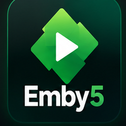

<p align="center">
  <br>
  <b>A native Emby client for jailbroken PS5 consoles.</b><br>
  Its own GPU-drawn interface, hardware-decoded 4K HDR playback, and no browser in between.
</p>

<p align="center">
  
  
  
  
</p>

---

> **Emby5 port status:** This tree is the first Emby hardware-test port made from the uploaded Jelly5 source. The PS5 playback/UI engine is retained; the server layer now uses Emby authentication, `/emby` API routing, Emby views/resume/latest endpoints, Emby DirectStream URLs and separate `/download0/emby5` state. Jellyfin Quick Connect, SyncPlay and Seerr controls are intentionally hidden until Emby-native equivalents are implemented. See `EMBY5_TESTING.md` before the first console run.


## What it is

Emby5 is an app that appears on the PS5 home screen under **Media**. Everything you see is drawn directly on the GPU at the
panel's own resolution: large backdrops, rows that slide and lift, blur and
glass, artwork that fades in over its BlurHash. Video goes through the console's
own hardware decoder.

It speaks directly to your Emby server. There is no extra backend and no account other than your Emby server.

## Features

**An interface made for the TV**
- Liquid glass throughout: controls on frosted, light-bending glass, and one springy glass drop that marks the focus wherever you are
- Home with a hero, *Continue watching*, *Next up*, *Recently added* per library, recommendations and genres, in the order you set in Emby
- Detail pages with logo art, cast, seasons and episodes, trailers, extras, *More like this* and the title's theme music
- Libraries for movies, shows and music: sort, filter (unwatched, favourites, genre, decade) and jump A–Z by letter
- Search across movies, shows, episodes, music and people
- Several users and servers with profile pictures, and a screensaver drawn from your own backdrops
- English, Spanish, French, German, Portuguese, Italian and Norwegian, following the PS5's system language

**Signing in**
- Finds Emby servers on your network by itself
- User name and password with the PS5's system keyboard

**Playback**
- Hardware decoding of H.264 and HEVC up to 4K, HDR10 and HLG (Dolby Vision plays its HDR10 base layer)
- Direct play wherever the PS5 can, server transcoding where it can't, through a PS5 device profile
- Audio and subtitle tracks (SRT, ASS/SSA, PGS and more), subtitle styling and online subtitle search
- Chapters, subtitles and auto-play of the next episode; optional server-specific extras are enabled only when supported
- Choice between versions when a title has several
- Playback speed from 0.75× to 2×, the pitch kept
- An audio delay setting for soundbars and receivers, and a night mode that evens out loud and quiet with the dialogue lifted
- Playback info on L3: how the server serves it, codecs, decoder, bitrate and buffer
- Keeps going through network hiccups: a stream that breaks off resumes where it stopped
- Progress, resume and watched state synced with Emby; mark whole seasons or series as watched

**Music**
- Albums, artists, playlists and Instant Mix
- Background playback while you browse, a mini player and a full *Now playing* view with time-synced lyrics (word by word when the lyrics have it)
- A queue on *Now playing* (△): see what's next, jump to a track, shuffle, and repeat all or one; □ stops the music

**PS5 touches**
- Adaptive triggers: L2/R2 scrub against a resistance, faster the harder you press
- The DualSense light bar takes the colour of what is playing
- A 120 Hz interface on displays that support it, and its own background on the PS5 home screen
- Remote-control plumbing is retained for compatibility testing; unsupported Jellyfin-only group-play controls are hidden

## Formats

| | Plays on the PS5 | Notes |
| --- | --- | --- |
| Video | H.264, HEVC (Main, Main 10), VP9 and older formats | AV1 is transcoded by the server |
| HDR | HDR10, HLG, HDR10+ (as HDR10), Dolby Vision (its HDR10 base layer) | Dolby Vision profile 5 is transcoded |
| Audio | AAC, AC3, E-AC3, TrueHD, DTS (incl. DTS-HD MA), FLAC, Opus, MP3 and more | Decoded to multichannel PCM |
| Subtitles | SRT, ASS/SSA, PGS, DVD and DVB subtitles, WebVTT | Embedded or external |
| Containers | MKV, MP4, TS/M2TS, AVI and more | Blu-ray folders and ISO files are not supported |
| 3D | — | Side-by-side and top-and-bottom files are refused; 3D Blu-ray (MVC) plays in 2D |

## Installation

### What you need

- A **jailbroken PS5** that can load payloads:

  | Firmware | Jailbreak | Status |
  |---|---|---|
  | 11.60 | Poops | Tested |
  | 13.60 | Relapse | Works (reported by a user) |

  Other firmware with the same tools should work too. If yours does (or doesn't),
  open an issue and it goes in the list.
- **ShadowMount+**, which turns a homebrew folder into a tile on the home screen.
- A way to copy files to the console. **[ps5upload](https://github.com/phantomptr/ps5upload)**
  is recommended; plain FTP works too (**ftpsrv** on port 2121 or **etaHEN**'s
  on port 1337, with an FTP client such as FileZilla, Cyberduck or WinSCP).
- A **Emby server** (tested with 12.1) that the PS5 can reach, on the same
  network or over the internet.
- Optionally, **Seerr** 3.4 or newer (tested with 3.5) with Emby as its
  media server, for requests (see *Seerr* below).

### Install

1. **Download** `Emby5-<version>.zip` from the
   [latest release](../../releases/latest) and unzip it. Inside is a folder
   called `PPSA99505`.
2. **Start the jailbreak** on the PS5 as usual, with ShadowMount+ loaded (and
   your FTP server, if you use FTP).
3. **Upload the folder** `PPSA99505` to `/data/homebrew/` on the console, so
   that `/data/homebrew/PPSA99505/eboot.bin` exists:
   - with **ps5upload** (recommended): point it at the PS5 and upload the
     `PPSA99505` folder to `/data/homebrew/`;
   - or with **FTP**: connect to the PS5's IP address (*Settings -> Network ->
     Connection status* on the console) on your FTP server's port, create
     `/data/homebrew` if it is not there yet, and copy the folder in.
4. **Wait a moment.** ShadowMount+ picks the folder up and adds a **Emby5**
   tile under *Media* on the home screen (next to TV & Video). If it does not
   appear, run your payloads again, or reboot and jailbreak again.
5. **Open Emby5.** It looks for Emby servers on your network:
   - pick yours from the list, or type its address (for example
     `192.168.1.20:8096`, or `https://jellyfin.example.com`);
   - sign in with **Quick Connect**: scan the QR code with your phone and tap
     *Authorize*, or type the code under *Quick Connect* in Emby. You can
     also sign in with your user name and password.

That's it. Emby5 remembers the account, and several accounts and servers can
be added from the profile picker.

The zip also holds `PPSA99505.ffpfsc`, the same app as a PFS image, for
loaders that mount images. The folder route above is the tested one.

### Seerr (optional)

With [Seerr](https://github.com/seerr-team/seerr) (the successor of Overseerr
and Jellyseerr), Emby5 finds what your library doesn't have and requests it.
Seerr gets everything from TMDB itself, so the console only talks to Seerr, on
your network: it works without Internet on the PS5.

What Seerr needs: Emby as its media server, your Emby user imported in
Seerr (or *Enable New Emby Sign-In* on), and permission to request. For the
automatic sign-in, Seerr 3.4 or newer and Quick Connect enabled in Emby.

In Emby5, open *Settings* (your picture at the top right), then *Seerr*:

| Setting | |
| --- | --- |
| **Seerr** | On or off. Off, nothing is ever sent to Seerr. |
| **Address** | Seerr's address as the console reaches it. It starts as your Emby server's host on port 5055 (`http://192.168.1.20:5055`, say). A public domain that only works from outside your home will not work from the PS5. |
| **Sign-in** | *Automatic (Quick Connect)*: the first time, ✕ on *Seerr account* approves Quick Connect for the address shown; from then on Seerr signs in through your Emby account by itself, for that address only (a new address asks again). *Emby password* or *Seerr account (email)*: typed once with the PS5 keyboard. Only Seerr's session is kept, never a password. |
| **Seerr account** | Who is signed in. ✕ twice signs out (automatic sign-in then waits until you sign in again). Each Emby account on the console has its own. |
| **Test connection** | Checks the address, the session and the pictures. |

Once signed in, Seerr's results show under the library's in Search, the
*Discover* tab appears, and a title's page offers *Request*. On a Emby
series you have only part of, Options on a season or an episode offers
*Request more seasons*. Requests to separate 4K Radarr/Sonarr instances are not
offered. Seerr's own "hide available / requested" settings apply here too.

### Update

1. **Close Emby5 completely** first: PS button, then close it from the
   switcher. Replacing files under a running app can crash the console.
2. Upload the new `PPSA99505` folder's **files** over the old ones in
   `/data/homebrew/PPSA99505/` (overwrite), with ps5upload or FTP.

Do not delete the old folder and copy a new one, and never keep a second
folder with the same title ID anywhere under `/data/homebrew`: ShadowMount+
bind-mounts the folder, and replacing it breaks the mount. Your accounts and
settings are kept.

### Uninstall

Close Emby5, then delete `/data/homebrew/PPSA99505`. Its accounts, settings
and image cache are in the app's own data area (`/download0/emby5` as the app
sees it); nothing else on the console is touched.

### Troubleshooting

| Problem | What to do |
| --- | --- |
| No Emby5 tile | Check the path is exactly `/data/homebrew/PPSA99505/eboot.bin`; rerun ShadowMount+ or reboot and jailbreak again. |
| The upload fails (for example "Text file busy") | Emby5 is still running: close it with the PS button first. |
| Your server is not in the list | Type its address. Discovery needs UDP port 7359 to reach the server (in Docker: publish `7359/udp`, and *Enable auto discovery* on in Emby's networking settings). |
| A title won't play or stutters | Press **L3** while it plays and include that info in an issue. Over Wi-Fi, lower *Maximum quality* in Emby5's settings. |
| The receiver shows PCM, not Dolby Atmos | Expected: the PS5 gives apps no bitstream passthrough (see *Known limits*). |
| Seerr: "Not answering" | The address must be one the console reaches on your network (Seerr's local address, port 5055 by default). Check it with *Test connection*. |
| Seerr: "Automatic sign-in failed" | Seerr is older than 3.4, Quick Connect is off in Emby, or your Emby user is not in Seerr. Choose *Emby password* under *Sign-in*, or import the user in Seerr. |
| Seerr: no pictures | Seerr fetches them from TMDB: the Seerr server itself needs Internet. |

## Controls

| Button | In the menus | In the player |
| --- | --- | --- |
| ✕ | Select | Play / pause, select |
| ○ | Back one level at a time | Hide the controls, then leave the player |
| D-pad | Move | Show the controls; left/right seek in 10 s steps |
| L1 / R1 | Previous / next tab | Previous / next chapter |
| L2 / R2 | Previous / next letter (libraries sorted A–Z) | Rewind / fast forward, faster the harder you press |
| △ | Search | Episodes (a film: its chapters) |
| □ | Sort & filter (libraries) | Audio and subtitles |
| Options | Options for the selected title (watched, favourite, …; on a series' season or episode also *Request more seasons*) | The controls |
| Touchpad | *Now playing*, while music plays | The controls |
| L3 | | Playback info |

With HDMI Device Link enabled on the PS5 and CEC enabled on the TV, the TV
remote's arrows, OK and Back use the same controls: OK acts as ✕ and Back as ○.
The DualSense remains available alongside the remote.

## Known limits

These come from the platform, not from Emby5:

- No bitstream passthrough: Dolby Atmos and DTS:X play as 7.1 PCM.
- No true 24p output: the console runs the display at 60 or 120 Hz.
- Dolby Vision plays its HDR10 base layer. Profile 5, which has none, is transcoded by the server.
- AV1 is transcoded by the server for now.
- No 3D output, so side-by-side and top-and-bottom 3D files are not played.
- The app can't quit itself. Close it with the PS button.

## Privacy

Emby5 talks to your Emby server and, when you turn it on in its settings,
your Seerr server, and nothing else. Seerr gets what it shows from TMDB itself:
the console never contacts TMDB, YouTube or any other service, posters come
through Seerr's own image cache, and a trailer is a QR code that your phone
opens. Off, nothing is ever sent to Seerr. The one exception is opt-in: with
*Check for updates* turned on in its settings, it asks GitHub once a launch
whether there is a newer release. It keeps its accounts, settings, Seerr
session (never a password) and a 96 MB image cache in its own folder,
`/download0/emby5`, and writes nowhere else on the console. Release builds
send no logs anywhere.

## Reporting problems

Open an issue with your firmware, your Emby version, what you did and what
happened. For playback problems, the L3 playback info for the title helps a lot.

## Building

Emby5 builds natively on macOS (Apple silicon or Intel) and on Linux with the
[PS5 payload SDK](https://github.com/ps5-payload-dev/sdk) and pacbrew.
`scripts/setup-toolchain.sh` downloads both (pinned by checksum) into the
git-ignored `toolchain/` folder. What it needs first:

- **macOS**: Homebrew's LLVM, with `brew install llvm lld coreutils bash`
  (the system's bash 3.2 is too old for the build script).
- **Linux**: the distribution's LLVM. On Debian or Ubuntu:
  `sudo apt install build-essential clang lld llvm curl unzip zip python3-venv`.
  clang, lld and llvm must be the same version (tested with LLVM 21 on Ubuntu
  26.04); set `LLVM_CONFIG` (for example `llvm-config-21`) to pick one when
  several are installed.

```sh
scripts/setup-toolchain.sh                  # once: SDK, pacbrew sysroot, host zlib
cd app
eval "$(../scripts/setup-toolchain.sh --env)"
scripts/build.sh --release                  # → build/app/Emby5-<version>.zip
```

On macOS, run the build with Homebrew's bash: `"$(brew --prefix)/bin/bash" scripts/build.sh`.

A plain `scripts/build.sh` is the development build. It reads the git-ignored
`.env.local` (`JF_URL`, `PS5_HOST`, …), uses `JF_URL` as the default server,
and sends a debug log over UDP to the machine that built it (`scripts/log.sh`).
`scripts/deploy.py` uploads it to the console over FTP. `--release` leaves all
of that out.

`app/tests/host/run.sh` runs the Emby client against a real server on the
build machine (`JF_URL`, `JF_USER` and `JF_PASS` in `.env.local`), and
`app/tests/host/seerr.sh` the Seerr client (`SEERR_URL` as well): it signs in
with Quick Connect as the console does and reads search, discover, title pages,
Radarr/Sonarr options and quotas; a request is only shown unless `--for-real`
is given. Both need libcurl's headers (`libcurl4-openssl-dev` on Debian or
Ubuntu, included with macOS).


## Credits

Emby5 stands on the work of others in the PS5 scene and beyond:

- **[Nuvio PS5](https://github.com/theghostonline/Nuvio-PS5)** by Husam Osman: the native player, its session and subtitle handling, and the app packaging toolkit
- **[EVO Player](https://github.com/sainsaji/EVO-PLAYER-PS5)**: the media engine (demuxing, `sceVideodec2`, the AGC renderer, audio, HDR), shader pipeline tooling and much of what is known about the PS5's GPU from user space
- **[ps5-payload-dev SDK](https://github.com/ps5-payload-dev/sdk)** by John Törnblom and contributors, plus the pacbrew sysroot
- **[Switchfin](https://github.com/dragonflylee/switchfin)**, used as a reference for the Emby API
- **[OverShifted/LiquidGlass](https://github.com/OverShifted/LiquidGlass)** (MIT), whose refraction profile the glass shader follows
- [FFmpeg](https://ffmpeg.org), [libass](https://github.com/libass/libass), FreeType, HarfBuzz, [cJSON](https://github.com/DaveGamble/cJSON), [NanoSVG](https://github.com/memononen/nanosvg), [QR Code generator](https://www.nayuki.io/page/qr-code-generator-library) by Project Nayuki, and the Inter, Roboto and Noto typefaces
- **[Emby5-Seerr](https://github.com/viviandsx/Emby5-Seer)** by [@viviandsx](https://github.com/viviandsx): the Seerr integration (client, search, requests, Discover) and the Linux build. Thank you!
- [Seerr](https://github.com/seerr-team/seerr), whose own pages the requests follow
- The [Emby](https://jellyfin.org) project

Every component, its licence and where it is used are listed in
[`THIRD_PARTY_NOTICES.md`](THIRD_PARTY_NOTICES.md).

## License

Emby5 is free software under the **GNU General Public License v3.0 or later**
(see [`LICENSE`](LICENSE)). Code taken from Nuvio PS5, EVO Player and other
projects keeps its original notices; see [`THIRD_PARTY_NOTICES.md`](THIRD_PARTY_NOTICES.md).

## Disclaimer

Emby5 is an unofficial homebrew project, provided **as is, without any
warranty** of any kind, express or implied, as set out in sections 15 and 16 of
the GPL. **You use it entirely at your own risk.** The authors and contributors
are not responsible or liable for any damage, data loss, malfunction, account
or online-service consequences, or any other harm, to your console, your
devices, your data or anything else, arising from installing, using or being
unable to use it.

Running homebrew requires a jailbroken console, which may break Sony's terms
of service and void your warranty. Whether you do so is your choice and your
responsibility.

Emby5 contains no media and gives access to no content of its own: it plays
what is on your own Emby server. Use it only with media you have the right
to watch.

Emby5 is not affiliated with or endorsed by Sony Interactive Entertainment or
the Emby project. *PlayStation*, *PS5* and *DualSense* are trademarks of
Sony Interactive Entertainment Inc.
